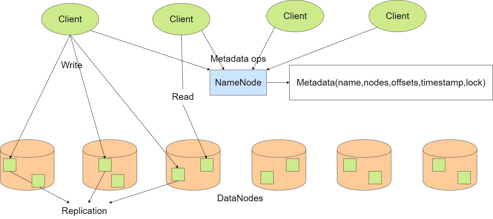

# LiteDFS
LiteDFS is a simple distributed file system implementation as a course project of Distributed System using gRPC to communicate between servers and clients.
LiteDFS uses a master-slave architecture. The master node, NameNode, is responsible for managing the metadata of the file system. The slave node, DataNode, is responsible for storing the replica data of the file system. The client can access the file system through the NameNode and get the data from the DataNode.Clients can cache the data in the local file system to improve the performance. To ensure the consistence among the replicas, LiteDFS adopts instantaneous consistency model using file read-write lock, which means the replicas are updated immediately after the file is updated. In additon, to ensure the consistency between the client's cache and the replicas, LiteDFS use timestamp to check whether the cache is out of date. If the cache is out of date, the client will update the cache from the replicas.
LiteDFS supports basic file operations, such as touch, mkdir, ls, rm, vim, cat, etc.

<center>
    
    <figcaption style="font-size:14px">LiteDFS架构</figcaption>
</center>

## File Structure
```shell
.
│  .gitignore
│  DFS_parameter.py                 # DFS global parameters
│  LICENSE
│  README.md
│
├─.vscode
│      settings.json                # vscode settings
│
├─Client
│      client.py                    # client
│
├─DataNode
│  │  data_node.py                  # data node
│  │
│  └─proto
│          data_node.proto          # data node proto
│          data_node_pb2.py
│          data_node_pb2_grpc.py
│
└─NameNode
    │  name_node.py                 # name node
    │
    └─proto
            name_node.proto         # name node proto
            name_node_pb2.py
            name_node_pb2_grpc.py
```
## Usage
### Prerequisites
- Python
- grpcio-tools
### Run
1. Start the NameNode
```shell
python NameNode/name_node.py
```
2. Start the DataNode
```shell
python DataNode/data_node.py --ip <ip> --port <port>
```
3. Start the Client
```shell
python Client/client.py --username <username> 
```
## Client Commands
```shell
    General Help

    Usage: command [options] [arguments]   

    Available Commands:
    ls             List contents of a directory.
    cd             Change the current working directory.
    rm             Remove file.
    touch          Create an empty file.   
    mkdir          Create a new directory. 
    rmdir          Remove an directory.    
    cat            Display the contents of a file.
    notepad        Open a file in Notepad. 
    vim            Open a file in the Vim text editor.
    help           Display help information for a specific command.

    Usage Examples:
    ls /path/to/directory
    cd /path/to/directory
    rm /path/to/myfile.txt
    touch myfile.txt
    mkdir new_directory
    rmdir /path/to/directory
    cat myfile.txt
    notepad myfile.txt
    vim myfile.txt
    help ls

    For detailed help on each command, use 'help' followed by the command name:
    help ls
    help cd
```
## Insufficient
As a course project, LiteDFS is not perfect because of limited time. There are still some problems to be solved.
For example:
- Instantaneous consistency model is not suitable for large-scale distributed file system. It will cause a lot of network traffic and slow down the system.
- LiteDFS does not support tolerance to failures. If the DataNode fails, the file system will be unavailable.
- NameNode is not able to backup the metadata. If the NameNode fails, the file system will be unavailable.
- LiteDFS uses stream to transfer the file between the client and the DataNode. But it does not chunk the file to improve the performance, which means the file is stored in the DataNode as a whole. 
