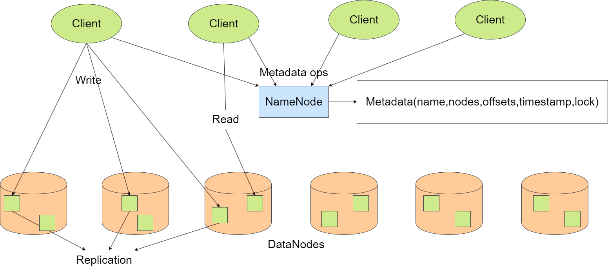

# 分布式文件系统 {ignore}
## 目录 {ignore}
[TOC]

## 题目要求
设计一个分布式文件系统。该文件系统可以是 client-server 架构，也可以是 P2P 非集中式架构。 要求文件系统具有基本的访问、打开、删除、缓存等功能，同时具有一致性、支持多用户特点。 在设计过程中能够体现在分布式课程中学习到的一些机制或者思想，例如 Paxos 共识、缓存更新机制、访问控制机制、并行扩展等。
1. 文件系统中不同节点之间的通信方式采用RPC模式
2. 文件系统具备基本的文件操作模型包括：创建、删除、访问等功能
3. 作为文件系统的客户端要求具有缓存功能即文件信息首先在本地存储搜索，作为缓存的介质可以是内存也可以是磁盘文件
4. 为了保证数据的可用性和文件系统性能，数据需要创建多个副本，且在正常情况下，多个副本不在同一物理机器，多个副本之间能够保持一致性（可选择最终一致性即延迟一致性也可以选择瞬时一致性即同时写）
5. 支持多用户即多个客户端，文件可以并行读写（即包含文件锁）
## 解决思路
### 架构设计
使用Master-Slave架构（如HDFS），Master(NameNode)负责文件的元数据管理，Slave负责文件的存储。

<center>
    
    <figcaption style="font-size:14px">LiteDFS架构</figcaption>
</center>

### Client文件操作
Client通过NameNode获取文件的元数据，再通过DataNode新建/删除/更新/获取文件，由此不需要集中式的节点用于读取文件内容，减轻了Master的压力。

### 客户端缓存
为了避免每次读取文件都需要从DataNode中获取文件内容，客户端在本地缓存文件内容，提高系统的读取性能。
在客户端设置一个路径用于存储缓存数据。为了保证缓存与存储服务器中的数据的一致性，在NameNode中存储文件的时间戳，同时本地客户端也存储缓存文件的时间戳，用于判断缓存是否过期。
新建文件：同时也在本地创建对应的缓存文件。
读取文件：首先判断缓存文件是否存在，若存在则判断缓存文件是否过期，若未过期则直接读取缓存文件，否则从DataNode中读取文件内容并更新缓存文件。
写入文件：更新缓存文件和NameNode中的时间戳，并将缓存文件内容写入DataNode。
删除文件：若存在本地缓存文件，同时删除缓存文件。

### 副本
在新建文件时，NameNode会选择多个DataNode存储副本文件，同时在NameNode中存储副本位置信息。
在读取文件时，NameNode决定Client读取的DataNode，从而均衡DataNode的负载。
为了保证副本的一致性，避免Client读取到过期的副本，采用瞬时一致性，当Client写入文件时，对所有副本进行更新，实现同步写。

### 并行读写
LiteDFS支持多个客户端访问，为了支持并行读写，采用文件读写锁。
以文件粒度创建读写锁，当一个客户端读取文件时，其他客户端只能读取文件，不能写入文件，当一个客户端写入文件时，其他客户端不能读取文件，也不能写入文件。

<center>
    
    <figcaption style="font-size:14px">文件读写锁</figcaption>
</center>

## 实现细节
### 文件元数据
在NameNode中需要存储文件的元数据，包括文件名、文件大小、文件时间戳、文件读写锁、文件副本位置信息。类定义如下：
```python
class FileNode:
    def __init__(self) -> None:
        self.ts = Timestamp()       # 时间戳
        self.ts.GetCurrentTime()
        self.node_ids = []          # 数据节点id
        self.offsets = []           # 数据节点中文件偏移量
        self.mtx = threading.Lock() # 读写锁
        self.r_count = 0            # 读数量
        self.w_lock = False         # 写锁
```
为了保存文件系统的结构，使用字典嵌套的形式存储文件系统树形结构，其中文件夹的key带有后缀'/'(如`folder/`)，文件夹的value为字典，文件的value为FileNode对象。
### 文件存储索引
实际情况下，在存储服务器中，文件存储于磁盘/硬盘，Client可以通过偏移量读取数据块。
由于时间原因，对建模进行简化，假设一个文件大小不超过一个块的大小，忽略文件分块存储的步骤。另外，为了模拟文件存储，使用一个位图表示磁盘/硬盘中块的使用情况，在模拟磁盘/硬盘中以偏移量为命名存储文件。
```python
self.blocks = [True] * block_count
```
### 文件缓存
在客户端中，若使用相同的路径结构存储缓存文件，则存在缓存文件管理复杂的问题。同时，若在同一路径下存在同名的文件夹和文件，windows系统会报错，由此在内存中保存缓存文件的逻辑结构（类似于NameNode），保存缓存文件名和时间戳，使用`uuid`模块生成文件路径与缓存文件名之间的映射关系。
```python
file['id'] = str(uuid.uuid5(uuid.NAMESPACE_URL, '/'.join(path_list))) # 文件id
file['ts'] = ts # 时间戳
```
### 文件读取
在读取文件前，先通过gRPC从NameNode获取访问的存储节点以及对应的文件偏移量，再通过gRPC访问存储节点DataNode获取文件内容。为了避免文件传输占用过多内存和网络带宽，需要采用流式传输。
DataNode根据文件内容进行分块并迭代返回。
```python
def read(self, request, context):
    offset = request.offset
    with open(self.prefix+str(offset),'rb') as file:
        for chunk in iter(lambda: file.read(DFS_parameter.__chunk_size__), b''): # 文件分块
            yield d_pb2.ReadDataResponse(data=chunk)
```
Client通过gRPC返回的迭代器分块读取文件内容保存至缓存文件中。
```python
node = response.node
offset = response.offset
with grpc.insecure_channel(node) as channel: # 连接DataNode
    stub = d_pb2_grpc.DataNodeStub(channel)
    response_iterator = stub.read(d_pb2.ReadDataRequest(offset=offset)) # 迭代器
    with open(self.prefix + file['id'], 'wb') as cache:
        for response in response_iterator: # 分块读取
            cache.write(response.data) # 写入缓存文件
```
### 文件写入
当Client申请写入文件且根据读写锁允许写入时，NameNode会返回存储文件副本的所有DataNode及对应的偏移量，之后Client通过gRPC连接所有DataNode，将文件内容写入DataNode。
同理，为了避免文件传输占用过多内存和网络带宽，需要采用流式传输。但与文件读取不同的是，DataNode传输文件数据前，需要先发送文件所在的偏移量进行索引。因此需要通过`oneof`定义传输的数据类型可以是偏移量或文件内容，并规定流传输的第一个数据为偏移量。
```protobuf
message WriteDataRequest{
    oneof upload{
        int32 offset = 1;
        bytes data = 2;
    }
}
```
DataNode接收到数据，首先读取偏移量，并打开对应的文件，之后分块将数据写入文件。
```python
def write(self, request_iterator, context):
offset = None
for chunk in request_iterator:
    if offset is None:
        offset = chunk.offset # 偏移量
        file = open(self.prefix+str(offset),'wb')
    else:
        file.write(chunk.data) # 写入文件
file.close() # 关闭文件
if DFS_parameter.__verbose_message__:
    print(f'{self.ip_port}:>Write block {offset}')
return d_pb2.EmptyMsg()
```
此外，为了保证瞬时一致性，Client在写入文件时，需要同时更新所有副本，因此可以采用多线程同时通过gRPC更新所有副本，从而提高系统效率，避免读写锁阻塞其他客户端的访问过长时间。
```python
def upload_file(self, offset, file_path): # 文件分块
    yield d_pb2.WriteDataRequest(offset=offset)
    with open(file_path, 'rb') as file:
        for chunk in iter(lambda: file.read(DFS_parameter.__chunk_size__), b''):
            yield d_pb2.WriteDataRequest(data=chunk)

def upload_file_to_node(self, node, offset, data_iter): # 上传文件
    with grpc.insecure_channel(node) as channel:
        stub = d_pb2_grpc.DataNodeStub(channel)
        if DFS_parameter.__verbose_message__:
            print(f'Upload to {node}')
        stub.write(data_iter)

# 写入文件至存储节点
nodes = response.nodes
offsets = response.offsets
# 使用 ThreadPoolExecutor 并行处理上传
with futures.ThreadPoolExecutor() as executor:
    # 将节点、偏移量和上传数据打包成元组
    data_to_upload = zip(nodes, offsets, 
        [self.upload_file(offset, self.prefix + folder[path_list[-1]]['id']) 
            for offset in offsets])
    # 使用 map 方法并行处理上传
    executor.map(lambda args:self.upload_file_to_node(*args), data_to_upload)
```

### 文件删除
文件删除操作与文件写入类似，首先通过gRPC从NameNode获取存储文件副本的所有DataNode及对应的偏移量，之后Client通过gRPC连接所有DataNode，并行删除文件副本。
其中DataNode删除文件时，无需删除对应的文件，只需将位图中对应的块置为未使用即可。
```python
def rm(self, request, context):
    block_ids = request.offsets
    for block_id in block_ids:
        if DFS_parameter.__verbose_message__:
            print(f'{self.ip_port}:>Delete block {block_id}')
        self.blocks[block_id]=True # 无需删除文件，后续会直接覆盖
    return d_pb2.EmptyMsg()
```

### 文件新建
客户端新建文件后，首先在NameNode中创建文件元数据，NameNode随机选择保存文件副本的节点，并返回节点信息。之后Client通过gRPC连接用于保存文件副本的DataNode，新建一个空文件，并返回文件偏移量，最后将文件偏移量返回给NameNode，NameNode更新文件元数据。

### 存储服务器注册
因为在NameNode中需要保存存储服务器的`ip:port`用于客户端连接通信，因此在存储服务器启动时，需要向NameNode发送`ip:port`进行注册，NameNode接收到存储服务器的注册信息后，将存储服务器的`ip:port`保存至列表中。
```protobuf
message HelloRequest{
    string node = 1;
}
```

### 文件读写工具
为了方便测试，通过python的`subprocess`模块实现调用`notepad`和`vim`进行文件的编辑。此外，还能够通过`vim <file> -M`的方式进行文件的只读访问，从而测试文件读取锁的功能。
```python
def notepad(self, path):
    file_addr = self.open(path, 'write')
    if file_addr is None:
        return
    # 打开记事本
    subprocess.run(['notepad.exe', file_addr])
    self.close(path, 'write')

def vim(self, path, mode=None):
    if mode is None:
        file_addr = self.open(path, 'write')
        if file_addr is None:
            return
        # 打开vim
        subprocess.run(['vim.exe', file_addr])
        self.close(path, 'write')
    elif mode == '-M':
        file_addr = self.open(path, 'read')
        if file_addr is None:
            return
        # 打开vim
        subprocess.run(['vim.exe', '-M', file_addr])
        self.close(path, 'read')
    else:
        print('Invalid mode')
        return
```

## 运行情况
### 文件缓存运行
- 新建文件
    首先客户端新建文件，同时也会在本地生成缓存文件
    <center>
        
        <figcaption style="font-size:14px">新建文件生成缓存</figcaption>
    </center>

- 读取缓存文件
    客户端读取文件时，判断是否存在缓存文件且缓存文件是否未过期，若未过期则直接读取缓存文件
    <center>
        
        <figcaption style="font-size:14px">读取缓存文件</figcaption>
    </center>

- 获取缓存文件
    当不存在对应缓存文件时，从DataNode中获取文件内容，并生成缓存文件
    <center>
        
        <figcaption style="font-size:14px">获取缓存文件</figcaption>
    </center>

- 更新缓存文件
    缓存文件过期后，客户端会重新读取DataNode中的文件内容，并更新缓存文件
    <center>
        
        <figcaption style="font-size:14px">更新缓存文件</figcaption>
    </center>

### 文件写入运行
文件写入时，采用流式传输，将文件内容分块传输至DataNode，以下是传输一个文件大小为3-4M的文本文件的过程。
<center>
    
    <figcaption style="font-size:14px">文件写入运行</figcaption>
</center>

### 文件读取运行
对于缓存文件和DataNode中的文件内容的读取可见[文件缓存运行](#文件缓存运行)。
对于较大的文件，需要在传输过程中进行分块，避免占用过多内存和网络带宽，此处在客户端读取一个大小为3-4M的文本文件。
<center>
    
    <figcaption style="font-size:14px">文件读取运行</figcaption>
</center>

### 文件并行读写
- 同时读
    多个客户端同时读取文件，此时允许多个客户端一起读取文件内同。
    <center>
        
        <figcaption style="font-size:14px">同时读</figcaption>
    </center>

- 先读后写
    一个客户端先读文件，另一个客户端再申请写文件，此时以写模式打开文件的操作会被拒绝。
    <center>
        
        <figcaption style="font-size:14px">先读后写</figcaption>
    </center>

- 先写后读(写)
    一个客户端先写文件，另一个客户端再申请读(写)文件，此时以读(写)模式打开文件的操作会被拒绝。
    <center>
        
        <figcaption style="font-size:14px">先写后读(写)</figcaption>
    </center>

### 其他命令行操作
对于常见的命令行操作，如`ls`、`cd`、`rm`、`touch`、`vim`、`notepad`等，本次实验也进行了实现，可以使用`help`查看所有命令及功能。
```shell
General Help

Usage: command [options] [arguments]

Available Commands:
ls             List contents of a directory.
cd             Change the current working directory.
rm             Remove file.
touch          Create an empty file.
mkdir          Create a new directory.
rmdir          Remove an directory.
cat            Display the contents of a file.
notepad        Open a file in Notepad.
vim            Open a file in the Vim text editor.
help           Display help information for a specific command.

Usage Examples:
ls /path/to/directory
cd /path/to/directory
rm /path/to/myfile.txt
touch myfile.txt
mkdir new_directory
rmdir /path/to/directory
cat myfile.txt
notepad myfile.txt
vim myfile.txt
help ls

For detailed help on each command, use 'help' followed by the command name:
help ls
help cd
```
同时，针对非法的路径，已存在文件的重新新建等特殊情况，也进行了处理。
以下是使用部分命令行进行的操作：
<center>
    
    <figcaption style="font-size:14px">常用操作展示</figcaption>
</center>

程序的使用见`Readme.md`

## 遇到的问题
在实验过程中，首先遇到的问题是系统的建模，经过资料检索后，参照HDFS设计了系统，但是在具体实现过程中仍会遇到设计系统时所忽略的情况，需要对设计进行修改和细化。
在使用gRPC时，常常遇到参数和返回参数的设计问题，对于冗余信息的判断并不周全，进行了多次调整。
虽然gRPC为不同节点之间的通信提供了便利，但是在实现过程中，因为不熟悉gRPC的使用，导致在调试时出现了很多问题，经过多次调试和查阅资料后，解决了问题。
最后是因为时间问题，暂时无法进一步完善和优化系统。

## 总结
本次实验实现了一个简易的分布式文件系统。首先通过gRPC实现Client与NameNode、DataNode之间的通信。为了提高系统的容错性，在不同的DataNode中保存多份文件的副本，同时使用瞬时一致性保证副本内容一致性。此外，为了提高系统的读取性能，在客户端中对文件进行缓存，并使用时间戳保证缓存与存储服务器中的数据的一致性。其次，为了支持多个客户端的并行读写，使用文件读写锁，实现文件的并行读写。此外，通过调用外部编辑器，实现了文件的读写操作。
本次分布式文件系统的实现也存在一定的不足。文件的存储并不是分块的，而是进行了模型的简化。此外，在初始设计阶段，将新建和删除DataNode中文件的操作分配给Client，这会导致若使用文件分块存储时，更新服务器文件产生的新增或删除存储块操作难以实现，由于时间原因以及采用简化的模型，并未对此进行更改。另外，系统并不具备容错能力，也没有对文件进行权限管理，也没有实现NameNode和DataNode之间的心跳机制判断存储服务器是否仍在线，并且对于保存在内存中的逻辑结构并没有进行保存、重启后的恢复以及Snapshot，这些都是可以进行改进的地方。


